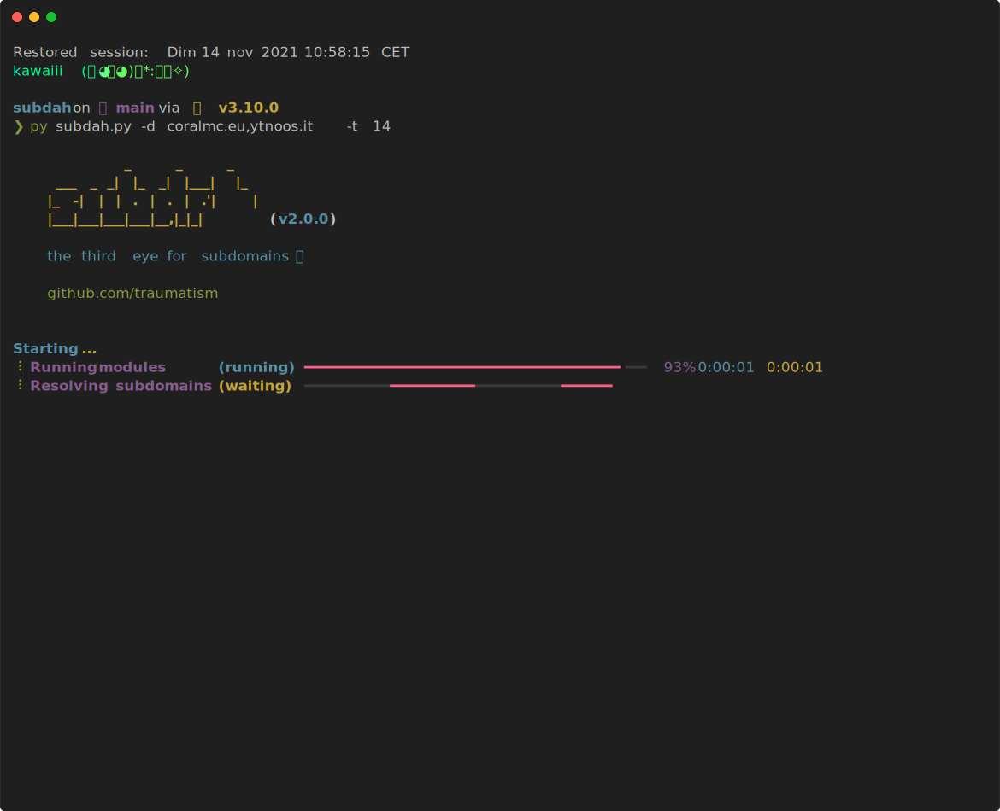

# Subdah




### Installation

⚠️ **Python 3.8+ required** ⚠️

```
$ git clone https://github.com/traumatism/subdah
$ cd subdah
$ pip3 install -r requirements.txt
```

### Running

```
$ python3.10 subdah.py [--debug] -d domain.com
```

### Adding your own scanning module

1. Add a Python module in the `modules/` folder.
2. Import the required modules
```python
# Abstract classes.
from lib.common.abc import Module, Subdomain

# Manage the database.
from lib import database
```
3. Create a subclass of `Module`
```python
class MyModule(Module):

    def run(self):
        pass
```
4. Put your scanning code in the `run()` function
```python
def run(self):

    # this list should contain all the subdomains
    # gathered after running module
    subdomains: List[Subdomain] = [
        Subdomain("s1.domain.com"), 
        Subdomain("s2.domain.com")
    ]

    # add the found subdomains to the database
    for subdomain in subdomains:
        database.add_subdomain(subdomain)
```
5. Add your module to the modules list in `subdah.py`
```python
from modules.mymodule import MyModule

modules = (…, MyModule)

```
6. And you done!
